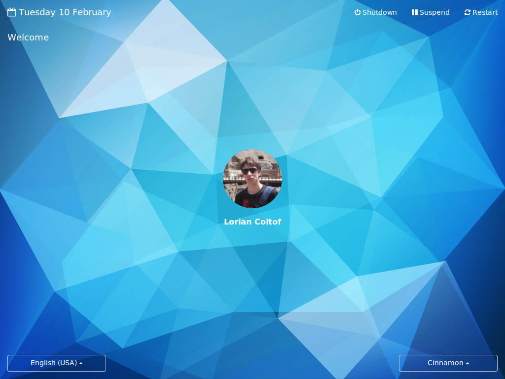
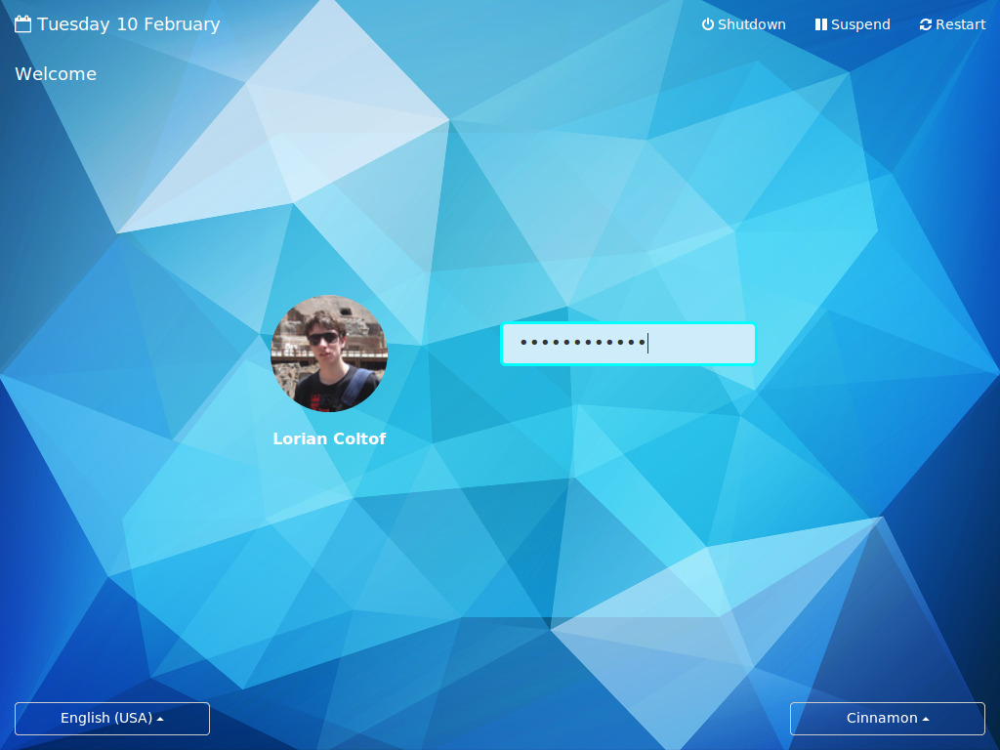
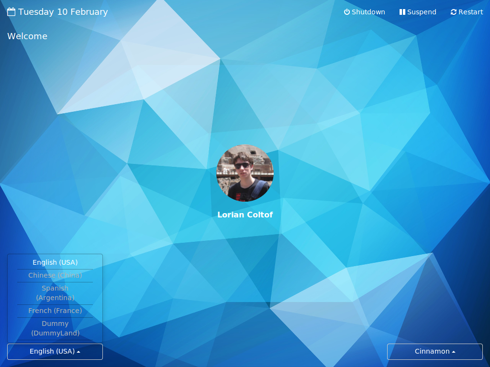

Round MDM Login theme V2
=========

## Overview

Improved version of [Round](https://github.com/koenhendriks/Round). It's coded in HTML, jQuery and CSS3 and uses mdm as screen manager.
It has support for multi language, multi sessions, and multi users. Default system functions like shutting down or restarting are also implemented.

In the middle of the screen are the images of the users. If a user is clicked it will slide to the left revealing the password input. If the user doesn't have a password set it will log in immediately on the click.
Animations are done with CSS3 transitions.

## Features

Currently supports the following:

- Login with or without password
- User profile picture and full name
- Change session
- Change language
- Shutdown/suspend/restart
- Show time and date
- Show error messages


## Screenshots





## Installation

It depends on your system, but here's how to install for Linux Mint:

1. Clone into the MDM themes directory:

    ```bash
    $ sudo git clone https://github.com/lorian1333/RoundV2.git \
      /usr/share/mdm/html-themes/RoundV2
    ```
    
2. Fix permissions:

    ```bash
    $ sudo chmod -R 776 RoundV2/
    ```
    
3. Open up the preferences panel and select the theme from the HTML list:

    ```bash
    $ sudo mdmsetup
    ```
    or 

    System Settings --> Administration --> Login Screen  

## User Profile Picture

To set your profile picture use the Users and Groups settings under  System Settings --> Administration --> Users and Groups.

or 

put a `jpg` file named `.face` in your home directory,
that is, a hidden file named `face`. 

## Uninstallation

First, change your theme via the preferences panel, then simply remove the theme
from MDM's html-themes directory:

```bash
$ sudo rm -rf /usr/share/mdm/html-themes/RoundV2
```

## License

GPL v2 -- See License file
